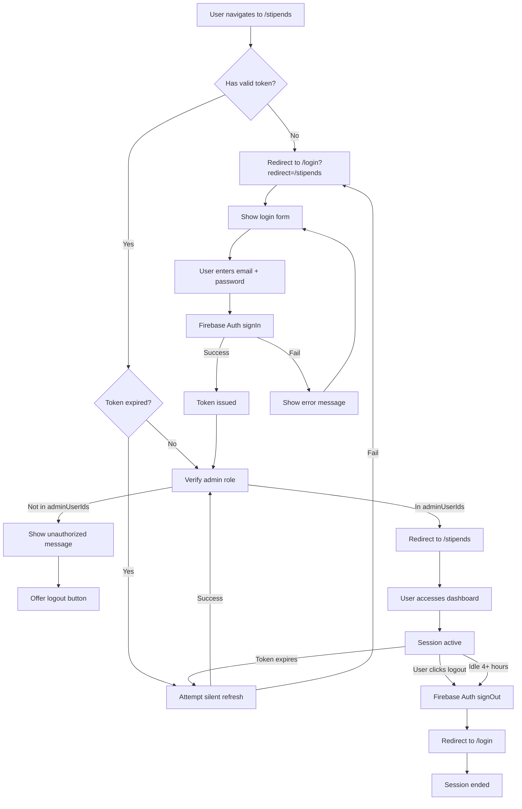

# Admin Authentication Flow

## Overview

The admin authentication flow controls access to the COMPASS dashboard through Firebase Auth email/password login with role-based access control (RBAC). Only users whose UIDs are listed in `app_settings.adminUserIds` can access the dashboard. This flow encompasses login, session management, token refresh, and logout.

## Problem Statement

The original DFWAIC App Dashboard had email/password authentication but:
- No role distinction at the data layer (security rules were all `allow: if true`)
- No admin verification (anyone with credentials could access everything)
- Logout button existed but was non-functional
- No session timeout or token refresh logic
- No redirect to intended destination after login

The fresh build implements proper authentication with:
- Server-side admin role verification on every API call
- Client-side route guards protecting all dashboard pages
- Automatic token refresh to prevent mid-session logouts
- Secure logout with session cleanup
- Login redirect to originally requested page

## Actors

- **User:** Person attempting to access the admin dashboard (may or may not be an admin)
- **System:** COMPASS application (client + server)
- **Firebase Auth:** Authentication service
- **Firestore:** Database containing app_settings with adminUserIds

## Preconditions

- User has a Firebase Auth account (created by super-admin via Firebase Console or future invite system)
- User's UID may or may not be in `app_settings.adminUserIds`
- User is accessing the dashboard URL in a modern browser

## Flow Diagram

### flex_block type="flow"



## Detailed Steps

### Phase 1: Access Attempt

**Step 1.1:** User navigates to any dashboard page (e.g., `/stipends`, `/users`, `/`)

**Step 1.2:** Nuxt route middleware (`~/middleware/auth.global.ts`) executes before page loads

**Step 1.3:** Middleware checks for Firebase Auth token
- **Found + valid:** Continue to Step 2
- **Found + expired:** Attempt silent refresh (Step 1.4)
- **Not found:** Redirect to login (Step 1.5)

**Step 1.4:** Silent token refresh
```typescript
const newToken = await currentUser.getIdToken(true)  // Force refresh
if (newToken) {
  // Continue to Step 2
} else {
  // Redirect to login (Step 1.5)
}
```

**Step 1.5:** Redirect to login page with return URL
```typescript
navigateTo(`/login?redirect=${to.fullPath}`)
```

### Phase 2: Login

**Step 2.1:** Display login page (`/login`) with COMPASS branding
- Email input field
- Password input field
- "Forgot Password?" link
- "Sign In" button

**Step 2.2:** User enters email and password

**Step 2.3:** Client-side validation
- Email format check (regex)
- Password non-empty check
- Show inline errors if invalid
- If valid, proceed to Step 2.4

**Step 2.4:** Call Firebase Auth
```typescript
try {
  await signInWithEmailAndPassword(auth, email, password)
  // Success → Step 3
} catch (error) {
  // Failure → Step 2.5
}
```

**Step 2.5:** Handle authentication errors
| Error Code | User Message | Recovery |
|-----------|-------------|----------|
| `auth/wrong-password` | "Invalid email or password" | Retry or use forgot password |
| `auth/user-not-found` | "Invalid email or password" | Same message to prevent email enumeration |
| `auth/too-many-requests` | "Too many attempts. Try again in 5 minutes." | Wait and retry |
| `auth/user-disabled` | "This account has been disabled. Contact your administrator." | Contact admin offline |
| `auth/network-request-failed` | "Unable to connect. Check your internet connection." | Check connection and retry |
| Other | "Login failed. Please try again." | Retry or contact support |

Show error message above login form, keep email field populated, clear password field.

### Phase 3: Admin Verification

**Step 3.1:** Firebase Auth token is now valid (stored in auth state)

**Step 3.2:** Client fetches app settings
```typescript
const settingsRef = doc(db, 'app_settings', 'config')
const settings = await getDoc(settingsRef)
const adminUserIds = settings.data().adminUserIds
```

**Step 3.3:** Check if user is admin
```typescript
const isAdmin = adminUserIds.includes(auth.currentUser.uid)
```

**Step 3.4:** Branch on admin status
- **Is admin:** Continue to Step 4 (redirect to dashboard)
- **Not admin:** Show unauthorized page (Step 3.5)

**Step 3.5:** Unauthorized state
- Display page: "Unauthorized: Admin access required"
- Show message: "Your account does not have admin privileges. Contact your administrator if you believe this is an error."
- Show button: "Sign Out"
- Clicking "Sign Out" → Firebase Auth signOut → Redirect to /login

### Phase 4: Session Established

**Step 4.1:** Redirect to intended destination
```typescript
const redirect = route.query.redirect || '/'
navigateTo(redirect)
```

**Step 4.2:** Set up Firestore listeners for global data
- Users collection (for count and on-duty status)
- App settings (reactive admin check)

**Step 4.3:** Session is now active
- User can navigate between dashboard pages without re-authenticating
- Middleware checks token on each navigation but doesn't require re-login
- Token auto-refreshes every ~50 minutes (Firebase default: 1 hour expiry, refresh at 50 min)

### Phase 5: Session Maintenance

**Step 5.1:** Automatic token refresh (Firebase SDK handles this)
- Token expires after 1 hour
- SDK automatically calls refresh 5-10 minutes before expiry
- If refresh succeeds, session continues seamlessly
- If refresh fails (account disabled, network error), user is logged out

**Step 5.2:** Idle timeout (optional, configurable)
- If user is inactive for 4+ hours, force logout
- Implemented via client-side idle detection:
```typescript
let lastActivity = Date.now()
const IDLE_TIMEOUT = 4 * 60 * 60 * 1000  // 4 hours

window.addEventListener('mousemove', () => { lastActivity = Date.now() })
window.addEventListener('keydown', () => { lastActivity = Date.now() })

setInterval(() => {
  if (Date.now() - lastActivity > IDLE_TIMEOUT) {
    signOut(auth)
    navigateTo('/login?timeout=true')
  }
}, 60 * 1000)  // Check every minute
```

**Step 5.3:** Server-side token verification (every API call)
```typescript
// Nuxt server API route pattern
export default defineEventHandler(async (event) => {
  const token = getCookie(event, 'auth-token')  // Or from Authorization header

  try {
    const decodedToken = await adminAuth.verifyIdToken(token)
    const uid = decodedToken.uid

    // Double-check admin status server-side
    const settings = await adminDb.doc('app_settings/config').get()
    const isAdmin = settings.data().adminUserIds.includes(uid)

    if (!isAdmin) {
      throw createError({ statusCode: 403, message: 'Forbidden: Admin access required' })
    }

    // Proceed with API logic
  } catch (error) {
    throw createError({ statusCode: 401, message: 'Unauthorized: Invalid token' })
  }
})
```

### Phase 6: Logout

**Step 6.1:** User clicks "Sign Out" button in navbar

**Step 6.2:** Call Firebase Auth signOut
```typescript
await signOut(auth)
```

**Step 6.3:** Clear client-side state
- Detach all Firestore listeners
- Clear any cached data
- Clear any local storage keys (if used)

**Step 6.4:** Redirect to login page
```typescript
navigateTo('/login')
```

**Step 6.5:** Session ended
- User must log in again to access dashboard
- Token is invalidated (cannot be reused)

## Error Flows

### Error Flow 1: Account Disabled Mid-Session

**Trigger:** Admin A disables admin B's account while B is actively using the dashboard

**Steps:**
1. Admin B navigates to a new page
2. Middleware checks token validity
3. Firebase Auth returns `auth/user-disabled`
4. Client immediately logs out and redirects to login
5. Login attempt shows "This account has been disabled"

### Error Flow 2: adminUserIds Removed Mid-Session

**Trigger:** Admin A removes admin B's UID from `app_settings.adminUserIds` while B is actively using the dashboard

**Steps:**
1. Admin B attempts an API call (e.g., saving a profile edit)
2. Server verifies token (valid) then checks adminUserIds (B is not in list)
3. Server returns 403 Forbidden
4. Client shows error toast: "Your admin access has been revoked. Please refresh the page."
5. On refresh, client-side admin check fails, shows unauthorized page

### Error Flow 3: Network Interruption During Login

**Trigger:** User submits login form but loses internet connection

**Steps:**
1. Firebase Auth call times out after 10 seconds
2. Client shows error: "Unable to connect. Check your internet connection."
3. User reconnects, clicks "Sign In" again
4. Login succeeds normally

### Error Flow 4: Expired Token + Refresh Failure

**Trigger:** User's token expires while they're idle, then they attempt to navigate

**Steps:**
1. User clicks a link (e.g., Users → Duty Days)
2. Middleware detects expired token, attempts refresh
3. Refresh fails (network issue or account disabled)
4. Middleware redirects to login with message: "Your session has expired. Please log in again."
5. User logs in and is redirected to originally intended page

## Security Considerations

### Defense Against Common Attacks

**Brute Force Protection:**
- Firebase Auth rate-limits login attempts (5 failures = temporary lockout)
- No additional client-side throttling needed

**Email Enumeration Prevention:**
- `auth/user-not-found` and `auth/wrong-password` show same message
- Prevents attackers from discovering valid email addresses

**Session Fixation:**
- Firebase Auth generates new token on each login
- Old tokens are invalidated on password change

**Token Theft:**
- Tokens are stored in httpOnly cookies (future enhancement) or secure localStorage
- Short expiry (1 hour) limits damage window
- HTTPS required in production (enforced by Vercel)

**Role Escalation:**
- Admin status is verified both client-side (for UI) and server-side (for data access)
- Client-side check can be bypassed (attacker modifies code) but server rejects unauthorized API calls
- `app_settings.adminUserIds` is the single source of truth

### Audit Trail

Every login creates an implicit audit entry via Firebase Auth logs (accessible in Firebase Console). Future enhancement: explicit audit_log entry for every admin login/logout.

## UI States

### Login Page States

| State | Trigger | UI Elements |
|-------|---------|------------|
| **Default** | Page load | Email/password fields enabled, Sign In button enabled, no error message |
| **Loading** | Form submitted | Fields disabled, Sign In button shows spinner, "Signing in..." text |
| **Error** | Auth failure | Error message above form (red background), fields re-enabled, Sign In button enabled |
| **Success** | Auth success | Brief "Redirecting..." message, then navigate away |

### Unauthorized Page

- **Header:** "Unauthorized Access"
- **Message:** "Your account does not have admin privileges. Contact your administrator if you believe this is an error."
- **Button:** "Sign Out" (secondary style)
- **Visual:** Icon or illustration of locked dashboard

### Session Timeout Banner

- **Trigger:** Idle timeout reached or token refresh failed
- **Position:** Top of page (yellow banner)
- **Message:** "Your session has expired. Click here to log in again."
- **Action:** Click banner → redirect to login

## Acceptance Criteria

- [ ] User without valid token is redirected to /login when accessing any dashboard page
- [ ] Login form validates email format and non-empty password client-side
- [ ] Successful Firebase Auth login redirects to originally requested page (or / if none)
- [ ] User whose UID is not in adminUserIds sees unauthorized page after login
- [ ] Unauthorized page offers logout button that signs out and returns to login
- [ ] Token is automatically refreshed before expiry without user action
- [ ] User can manually log out via Sign Out button in navbar
- [ ] Logout clears session and redirects to login page
- [ ] Server API routes verify admin status on every call
- [ ] Account disabled mid-session triggers immediate logout
- [ ] Network errors during login show user-friendly error message
- [ ] Wrong password shows "Invalid email or password" (same as user-not-found)
- [ ] Idle timeout (4 hours) forces logout if enabled

## Related Specs

- **024-database_audit-settings-collections.md:** app_settings.adminUserIds is the admin role source
- **FL-002:** Password Reset (triggered from login page via "Forgot Password?" link)
- **FL-003:** Session Management (token refresh and timeout logic)
- **SYS-002:** Audit Trail Pipeline (future: log all admin logins)

## Future Enhancements

- **Multi-factor authentication (MFA):** Require SMS or authenticator app code after password
- **SSO integration:** Google Workspace or Azure AD for enterprise auth
- **Invite system:** Admins can send email invites that auto-create accounts and add to adminUserIds
- **Session history:** Track active sessions per admin, allow remote logout
- **Audit login events:** Create audit_log entries for every login/logout with IP and user agent
