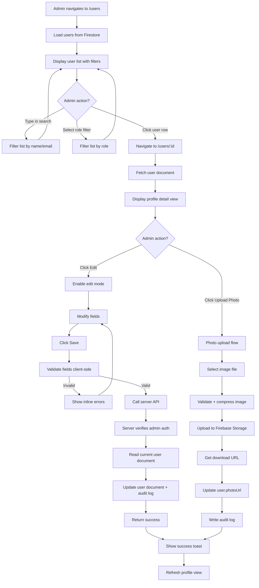

# User Profile Management Flow

## Overview

The user management flow enables admins to search, filter, view, and edit profiles for all users in the system (chaplains, interns, support staff). This includes modifying personal information, role assignments, terminal access, and uploading profile photos. Every edit operation is logged to the audit trail with before/after diffs for accountability.

## Problem Statement

The original DFWAIC App Dashboard had user management features but:
- No search functionality (admins had to scroll through entire list)
- Role filtering via chips but no compound filters (e.g., "chaplains at Terminal A")
- Profile editing via bottom sheet modal (mobile pattern, poor for desktop)
- No audit trail for profile changes (no record of who edited what and when)
- Photo upload worked but had no compression (large files wasted storage)
- Translated bios stored as 16 separate fields (`bio`, `bioSpanish`, `bioKorean`, etc.) — denormalization anti-pattern

The fresh build implements:
- Real-time search by name or email
- Multi-filter support (role + terminal + status)
- Full-page detail view with dedicated edit mode
- Server-side profile updates with audit logging
- Client-side image compression before upload
- Normalized bio storage: single `bio` field + `translatedBios` map

## Actors

- **Admin:** Authenticated user with admin privileges who manages other users' profiles
- **System:** COMPASS application (client + server)
- **Firestore:** Database storing user documents
- **Firebase Storage:** Blob storage for profile photos

## Preconditions

- Admin is authenticated and verified
- Users collection contains chaplain, intern, and support staff records
- Firebase Storage is configured for photo uploads

## Flow Diagram

### flex_block type="flow"



## Detailed Steps

### Phase 1: User List & Search

**Step 1.1:** Admin navigates to `/users`

**Step 1.2:** System loads users from Firestore
```typescript
const q = query(
  collection(db, 'users'),
  orderBy('displayName', 'asc'),
  limit(50)  // Pagination
)
const users = await getDocs(q)
```

**Step 1.3:** Display user list
- **Table columns:** Avatar, Name, Email, Role, Terminals, Status (On Duty badge)
- **Filter chips:** All Users (default), Chaplains, Interns, Support Staff
- **Search bar:** "Search by name or email..."
- **Pagination:** Show 50 users per page, "Load More" button

**Step 1.4:** Admin types in search field
- **Real-time filtering:** Filter list client-side as user types (no debounce delay)
- **Match logic:** Case-insensitive substring match on `displayName` OR `email`
- **Example:** Typing "martinez" shows "Maria Martinez" and "joe.martinez@email.com"

**Step 1.5:** Admin selects role filter chip
- **All Users:** No filter (shows everyone)
- **Chaplains:** Filter where `isChaplain === true`
- **Interns:** Filter where `isIntern === true`
- **Support Staff:** Filter where `isSupportMember === true`

**Step 1.6:** Filters combine (AND logic)
- Example: "Chaplains" chip + search "terminal A" → Shows chaplains with "Terminal A" in name/email
- Role filter applied first (Firestore query), search applied client-side

**Step 1.7:** Admin clicks a user row
- Navigate to `/users/{userId}` (user detail page)

### Phase 2: Profile Detail View

**Step 2.1:** System fetches user document
```typescript
const userRef = doc(db, 'users', userId)
const user = await getDoc(userRef)

if (!user.exists()) {
  // Show 404 page
}
```

**Step 2.2:** Display profile detail layout
- **Header section:**
  - Large avatar (150x150px)
  - Display name (h1)
  - Role badge (Chaplain, Intern, Support)
  - On Duty indicator (green dot if onDuty === true)
  - "Edit Profile" button (top right)
  - "Upload Photo" button (below avatar)

- **Personal Info section:**
  - Email (with mailto: link)
  - Phone number (with tel: link)
  - Title
  - Biography (plain text, expandable if > 500 chars)

- **Role & Access section:**
  - Checkboxes (read-only in view mode): Chaplain, Intern, Support, After Hours
  - Terminals: Chips showing assigned terminals (A, B, C, D, E)

- **Activity section:**
  - Total duty hours (all-time)
  - Last active timestamp
  - Created date

- **History tabs:**
  - Duty History (recent duty logs)
  - Stipend History (stipend records)
  - Audit Trail (edits to this profile)

### Phase 3: Profile Edit Mode

**Step 3.1:** Admin clicks "Edit Profile" button

**Step 3.2:** Switch to edit mode
- Same layout but all fields become editable:
  - **Text inputs:** displayName, email, phoneNumber, title
  - **Textarea:** bio (with character count, max 1000 chars)
  - **Dropdown:** role (admin, chaplain, intern, support)
  - **Toggles:** isChaplain, isIntern, isSupportMember, isAfterHours
  - **Multi-select:** terminals (A, B, C, D, E)

**Step 3.3:** Admin modifies fields
- **Inline validation:**
  - Email: Must be valid format
  - Phone: Optional, auto-format to (XXX) XXX-XXXX if US format detected
  - Display name: Required, max 100 chars
  - Bio: Max 1000 chars (show warning at 900)

**Step 3.4:** Admin clicks "Save Changes"

**Step 3.5:** Client-side validation
```typescript
const errors = []

if (!displayName.trim()) {
  errors.push({ field: 'displayName', message: 'Name is required' })
}

if (email && !isValidEmail(email)) {
  errors.push({ field: 'email', message: 'Invalid email format' })
}

if (bio.length > 1000) {
  errors.push({ field: 'bio', message: 'Bio must be under 1000 characters' })
}

if (errors.length > 0) {
  // Highlight error fields, show messages
  return
}

// Proceed to server call
```

**Step 3.6:** Call server API
```typescript
const response = await $fetch(`/api/users/${userId}/update`, {
  method: 'POST',
  body: {
    displayName,
    email,
    phoneNumber,
    title,
    bio,
    role,
    isChaplain,
    isIntern,
    isSupportMember,
    isAfterHours,
    terminals
  }
})
```

### Phase 4: Server-Side Processing

**Step 4.1:** Server API route (`/api/users/:id/update.post.ts`) receives request

**Step 4.2:** Verify admin authentication
```typescript
const admin = await verifyAdmin(event)  // Throws 401 if not admin
```

**Step 4.3:** Read current user document (for audit before diff)
```typescript
const userRef = adminDb.doc(`users/${userId}`)
const before = (await userRef.get()).data()
```

**Step 4.4:** Validate server-side (defense in depth)
```typescript
if (!body.displayName || body.displayName.length > 100) {
  throw createError({ statusCode: 400, message: 'Invalid display name' })
}

if (body.email && !isValidEmail(body.email)) {
  throw createError({ statusCode: 400, message: 'Invalid email' })
}
```

**Step 4.5:** Update user document with audit metadata
```typescript
await userRef.update({
  displayName: body.displayName,
  email: body.email,
  phoneNumber: body.phoneNumber,
  title: body.title,
  bio: body.bio,
  role: body.role,
  isChaplain: body.isChaplain,
  isIntern: body.isIntern,
  isSupportMember: body.isSupportMember,
  isAfterHours: body.isAfterHours,
  terminals: body.terminals,
  adminEditedAt: FieldValue.serverTimestamp(),
  adminEditedBy: admin.uid
})
```

**Step 4.6:** Create audit log entry
```typescript
await adminDb.collection('audit_log').add({
  action: 'profile_edit',
  adminId: admin.uid,
  targetId: userId,
  targetCollection: 'users',
  details: {
    before: pickRelevantFields(before, ['displayName', 'email', 'phoneNumber', 'role', 'terminals']),
    after: pickRelevantFields(body, ['displayName', 'email', 'phoneNumber', 'role', 'terminals']),
    summary: `Updated profile for ${body.displayName}`
  },
  createdAt: FieldValue.serverTimestamp()
})
```

**Step 4.7:** Return success
```typescript
return { success: true }
```

### Phase 5: Client Response

**Step 5.1:** API call succeeds

**Step 5.2:** Show success toast
```typescript
toast.success('Profile updated successfully')
```

**Step 5.3:** Exit edit mode, return to view mode

**Step 5.4:** Refresh user data from Firestore
- VueFire listener auto-updates (if using real-time binding)
- OR manual refetch: `await getDoc(userRef)` and update reactive state

**Step 5.5:** User sees updated profile immediately

### Phase 6: Photo Upload (Sub-Flow)

**Step 6.1:** Admin clicks "Upload Photo" button

**Step 6.2:** File picker opens
```typescript
<input
  type="file"
  accept="image/jpeg,image/png,image/webp"
  @change="handlePhotoSelect"
  ref="photoInput"
  hidden
/>
```

**Step 6.3:** User selects image file

**Step 6.4:** Validate file
```typescript
const MAX_SIZE = 5 * 1024 * 1024  // 5 MB
const ALLOWED_TYPES = ['image/jpeg', 'image/png', 'image/webp']

if (file.size > MAX_SIZE) {
  toast.error('Image must be under 5 MB')
  return
}

if (!ALLOWED_TYPES.includes(file.type)) {
  toast.error('Only JPEG, PNG, and WebP images are supported')
  return
}
```

**Step 6.5:** Compress image client-side
```typescript
// Using browser-image-compression library
const options = {
  maxSizeMB: 0.5,  // Target 500 KB
  maxWidthOrHeight: 800,  // Max dimension
  useWebWorker: true
}

const compressedFile = await imageCompression(file, options)
```

**Step 6.6:** Show upload progress indicator (spinner on avatar)

**Step 6.7:** Upload to Firebase Storage
```typescript
const storagePath = `user-photos/${userId}/${Date.now()}.jpg`
const storageRef = ref(storage, storagePath)
const uploadTask = uploadBytesResumable(storageRef, compressedFile)

uploadTask.on('state_changed',
  (snapshot) => {
    const progress = (snapshot.bytesTransferred / snapshot.totalBytes) * 100
    // Update progress indicator
  },
  (error) => {
    toast.error('Upload failed. Try again.')
  },
  async () => {
    // Upload complete, get download URL
    const downloadURL = await getDownloadURL(uploadTask.snapshot.ref)
    // Continue to Step 6.8
  }
)
```

**Step 6.8:** Update user document with new photoUrl
```typescript
await $fetch(`/api/users/${userId}/update`, {
  method: 'POST',
  body: { photoUrl: downloadURL }
})
```

**Step 6.9:** Create audit log entry (server-side)
```typescript
await adminDb.collection('audit_log').add({
  action: 'photo_upload',
  adminId: admin.uid,
  targetId: userId,
  targetCollection: 'users',
  details: {
    photoUrl: downloadURL,
    summary: `Uploaded new profile photo for ${userName}`
  },
  createdAt: FieldValue.serverTimestamp()
})
```

**Step 6.10:** Update avatar on page
- VueFire listener auto-updates photoUrl, avatar component re-renders
- Success toast: "Profile photo updated"

## Error Flows

### Error Flow 1: User Not Found

**Trigger:** Admin navigates to `/users/invalid-id`

**Steps:**
1. Server fetches user document
2. Document doesn't exist
3. Show 404 page: "User not found"
4. Button: "Back to User List" → navigate to `/users`

### Error Flow 2: Validation Error

**Trigger:** Admin enters invalid email and clicks Save

**Steps:**
1. Client-side validation catches invalid email
2. Email input field gets red border
3. Error message appears below field: "Invalid email format"
4. Save button remains enabled (user can correct and retry)
5. User corrects email, error clears, saves successfully

### Error Flow 3: Permission Denied

**Trigger:** Non-admin user somehow accesses edit API (bypassing client checks)

**Steps:**
1. Server verifies token, user is authenticated but not in adminUserIds
2. Server returns 403 Forbidden
3. Client shows error toast: "You don't have permission to edit profiles"
4. Page remains in view mode (no changes saved)

### Error Flow 4: Photo Upload Fails

**Trigger:** Network interruption during photo upload

**Steps:**
1. Upload progress indicator shows partial progress
2. Upload task fails with error
3. Toast error: "Upload failed. Check your connection and try again."
4. Avatar reverts to previous photo
5. User can retry upload

### Error Flow 5: Oversized Photo

**Trigger:** User selects 10 MB RAW image

**Steps:**
1. File validation catches size > 5 MB
2. File picker closes immediately
3. Toast error: "Image must be under 5 MB. Try a smaller file or crop the image."
4. No upload attempt

### Error Flow 6: Concurrent Edit Conflict

**Trigger:** Admin A and Admin B both edit the same user profile simultaneously

**Steps:**
1. Admin A loads profile (reads current state)
2. Admin B loads profile (reads same state)
3. Admin A saves changes (updates document)
4. Admin B saves changes (overwrites Admin A's changes)
5. **Result:** Last write wins (no optimistic locking in v1)
6. **Audit trail:** Two audit entries show both edits with timestamps
7. **Future enhancement:** Implement optimistic locking with version field

## UI States

### User List Page States

| State | Trigger | UI Elements |
|-------|---------|------------|
| **Loading** | Page load | Skeleton table rows, disabled filters |
| **Loaded** | Data fetched | Full user list, enabled filters |
| **Empty (no users)** | No users in collection | "No users found. Create a user to get started." |
| **Empty (no results)** | Search/filter returns nothing | "No users match your filters. Try adjusting your search." |
| **Error** | Firestore query fails | "Unable to load users. Refresh the page or try again later." |

### User Detail Page States

| State | Trigger | UI Elements |
|-------|---------|------------|
| **Loading** | Page load | Skeleton layout |
| **Loaded (view mode)** | Data fetched | Full profile, Edit button enabled |
| **Edit mode** | Click Edit | Editable fields, Save/Cancel buttons |
| **Saving** | Click Save | Disabled fields, Save button shows spinner |
| **Error (not found)** | User ID invalid | 404 page with back button |
| **Error (permission)** | Non-admin access | Unauthorized message |

### Photo Upload States

| State | Trigger | UI Elements |
|-------|---------|------------|
| **Idle** | Default | Upload button enabled, current avatar shown |
| **Uploading** | File selected, upload in progress | Avatar overlay with spinner + progress % |
| **Success** | Upload complete | Brief checkmark animation, new avatar shown |
| **Error** | Upload fails | Toast error, avatar reverts to previous |

## Acceptance Criteria

- [ ] Admin can search users by name or email with real-time filtering
- [ ] Admin can filter users by role (chaplains, interns, support staff)
- [ ] Search and role filters combine correctly (AND logic)
- [ ] Clicking a user row navigates to their detail page
- [ ] User detail page displays all profile fields in read-only view mode
- [ ] Clicking Edit Profile switches to edit mode with form fields
- [ ] Client-side validation prevents saving invalid data (empty name, bad email)
- [ ] Saving profile updates the Firestore document via server API
- [ ] Server API verifies admin authentication before allowing updates
- [ ] Every profile edit creates an audit log entry with before/after diff
- [ ] Photo upload validates file size (max 5 MB) and type (JPEG/PNG/WebP)
- [ ] Photos are compressed client-side before upload (max 800x800, JPEG 80%)
- [ ] Uploaded photo URL is saved to user.photoUrl field
- [ ] Photo upload creates an audit log entry
- [ ] Profile view refreshes automatically after save (VueFire listener or manual refetch)
- [ ] User not found shows 404 page with back button
- [ ] Validation errors show inline with red borders and messages
- [ ] Success toast appears after successful save or upload

## Related Specs

- **024-database_audit-settings-collections.md:** Audit log schema and server-side creation pattern
- **FL-006:** User Profile Edit (detailed flow steps)
- **FL-007:** Photo Upload (sub-flow)
- **004-database.md:** Users collection schema

## Future Enhancements

- **Bulk actions:** Select multiple users, bulk update terminals or role
- **Advanced filters:** Compound filters (chaplains at Terminal A who are after-hours)
- **Export:** Export filtered user list to CSV
- **Optimistic locking:** Add version field to prevent concurrent edit conflicts
- **Translation UI:** Edit translatedBios map inline (currently must edit via raw JSON)
- **Activity timeline:** Visual timeline of user's duty logs, stipends, and edits on detail page
